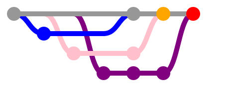
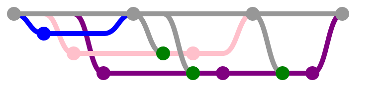

Mr. Fusion
==========

Git branch management and upkeeping made easier.  You can't make it completely automated, but you can remove almost all of the mundane work.

[![Build Status][travis-image]][Travis CI]

This software solves the problem that crops up when there are multiple branches being developed simultaneously in git repositories.  Let's say that you have three developers (Abel, Barney and Corey) working on three feature branches (`a`, `b`, and `c` respectively).  They all start from the project's `master` branch at the same time.

The problem arises from the mentality that "the first one to `master` wins!"

All three programmers are awesome at their jobs and try hard to create atomic commits.  Abel finishes first and his work is approved with QA.  He merges his code to `master`.  Barney finishes his work and neglects to merge in `master`.  His code is tested and when he tries to merge then there are many conflicts as indicated by the orange dot.  Barney is sad and stays an extra hour at work to untangle the merge so he can go home for the weekend.

Poor Corey.  He's been working on the biggest, most invasive feature out of the three developers.  Because of this, he's the last one to get his code to `master`.  Corey attempts to merge with `master` and is represented by the red dot.  He now has to resolve the problems that arise from both Abel's and Barney's changes!  Corey loses half of a day or more when trying to resolve the merge conflict.

Mitigating the Problem
----------------------

Mr. Fusion can run as a cron job and automatically perform clean merges on your behalf.  This means when Abel finishes his job then Abel's code is merged into `master` and all branches that use `master` as their parent.  Barney and Corey automatically will have Abel's code and can resolve conflicts.  This means they will be resolving potentially more conflicts, but the crucial bit is that the conflicts will be smaller.  Smaller conflicts are significantly easier to manage.

In this scenario, Mr. Fusion's commits are green dots.  They only happen when there is a clean merge.  When Barney merges to `master` and Corey gets Barney's changes (or is notified that the merge failed) then it has a much smaller impact on Corey.  He's dealing with a smaller change set than in the first scenario where Cory needed to handle the changes from multiple developers.

Usage
-----

Mr. Fusion is written in portable Bash and should operate anywhere Bash 3 or higher is installed.  This would work great in continuous integration environments.

    mr-fusion http://github.com/your_name_here/your_repo_here.git

Just point Mr. Fusion at the git repository (can be local or hosted elsewhere) and the merges will begin.

In order for Mr. Fusion to understand your branch hierarchy, it is essential that you create a `mr-fusion` branch in your project.  Mr. Fusion can do this for you!

    mr-fusion -i http://github.com/your_name_here/your_repo_here.git

Configuring
-----------

To see the configuration files for Mr. Fusion, you must first go to the `mr-fusion` branch in your repository.

    git checkout mr-fusion

If you prefer to name your `mr-fusion` branch another name, you can do that with an environment variable (`MR_FUSION_BRANCH`).  You will need to use this environment variable every time you invoke Mr. Fusion.

    MR_FUSION_BRANCH=another_branch mr-fusion ....

From here you will see a `config` and `branches.ini`.  You can also load plugins from your repository.

### config

This file has only environment variables and configuration directives for the execution of Mr. Fusion.  It is sourced into the environment after checking out a copy of the repository and before any merges happen.  There's only a few things that exist there and they are mostly for setting up git.

### branches.ini

This simple INI file lists the branches in the repository and their parent.  If there is an entry and it lists a parent, then Mr. Fusion will merge from the parent to the child.  The section names, such as `master` below, are in brackets and correspond to branch names.

    [master]

    [develop]
    parent=master

    [feature/juggernaut]
    parent=develop

    [feature/sparkle]
    parent=develop

    [feature/razzle-dazzle]
    parent=feature/sparkle

The cooler thing is that Mr. Fusion knows about dependencies.  For instance, it sees that `master` has no parent and thus no dependencies.  The merge from `master` to `develop` will happen before the merges from `develop` to `feature/juggernaut` and `feature/sparkle`.  After that, `feature/sparkle` will be merged into `feature/razzle-dazzle`.

### plugins/

This folder contains plugin scripts.  All of them are sourced and loaded into the environment.  They are simple Bash scripts and can use `hook-add` in order to attach themselves to various hooks that Mr. Fusion exposes especially for plugin authors to use.

The easiest way to install plugins is to use Mr. Fusion.  First, browse the [plugins/](plugins/) folder for a plugin's filename that you would want to install.  Next, use Mr. Fusion.

    mr-fusion -p plugin-name https://github.com/your_name_here/your_repo_here.git

If you intend to write your own plugins and you want to see how they work, there is documentation about [plugins](docs/plugins.md) that you should read.

License
-------

This software is licensed under a MIT license with an additional non-advertising clause.  See [LICENSE.md](LICENSE.md) for the full text.

[Travis CI]: http://travis-ci.org/tests-always-included/mr-fusion
[Travis-Image]: https://api.travis-ci.org/tests-always-included/mr-fusion.png
